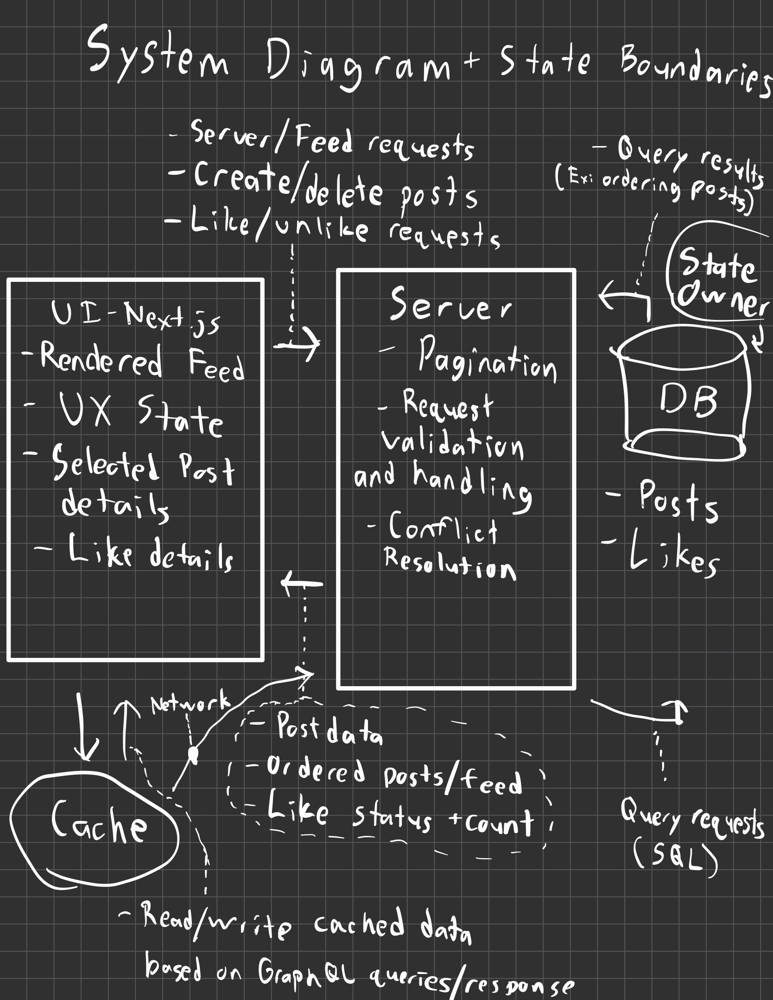

# Summary and Motivation

A. MVP Technical Problem Statement

This application is meant to design and create a simple end-to-end Newsfeed application with multiple functionalities for users. Users should be able to create, delete, and interact with posts. This includes being able to like and unlike posts, view them in reverse chronological order, open posts, and being able to see all of their details. The application consists of three main components, including a GraphQL API, a React-based UI, and a database. 

While the application is meant to be simple, there are still numerous challenges to consider as the UI, server, and database must operate separately and communicate asynchronously. It must be able to handle rapid user requests, multiple requests potentially occurring at the same time, or even potential network and server failures, for instance. As a result, careful design is crucial to ensure proper functionality, so that what the user wants, what the user actually sees, and what’s happening behind the scenes in the backend are all lined up. To elaborate on the features for the user: 

Because the posts and feed seen by the user are to be in reverse chronological order, it must be determined by server-associated metadata, namely the timestamp of the post’s creation. In other words, the post ordering can’t be a feature determined by the client, and they will see the specific order and state determined by the backend. Pagination must be used with server-issued cursors so that posts added between requests don’t cause duplicates to occur. 

Similarly, other features, including creating, editing, deleting, liking, and unliking posts, can all potentially lead to overlapping requests or requests that arrive to the server in a different order than what the user intended. Any optimistic updates on the client side and the UI must be possible to correct based on the backend server’s response. In other words, the specific order and state given by the backend is what the UI must display and follow regarding posts or likes.

The design of this application is meant to prioritize correctness for its basic functionality and associated challenges, rather than focusing on vast functionality, complexity, or sophistication. It is designed to have clear boundaries between the UI, server, and database layers. Ultimately, this application is meant to further understanding of how and why specific architectural and developmental decisions are made.

# Detailed design

B. System Diagram

C. Data Model

Post Schema:
post_id - post’s unique identifier
creator_id - identifier of the poster
content - text of the post itself
created_at - timestamp of when it was posted
edited_at - timestamp of when it was edited
like_count - number of likes on the post

Like Schema:
post_id - identifier of the post being liked
user_id  - identifier of the user liking the post
unique_id - pair of post_id, user_id
time - timestamp of when the like occurred

Pagination Approach: The feed uses cursor-based pagination to ensure that the posts and feed can be viewed by the user in reverse chronological order without causing duplication or missing posts. The cursor is derived from encoding the created_at timestamp and the associated post_id of the last post on the previous page and request. This ensures that posts are ordered from the most to the least recent timestamp of creation. The use of a cursor ensures that there can’t be duplicate posts, even on different pages or if there are posts being added or deleted in between requests, as the server will only request posts older than the timestamp which the cursor represents. Offset pagination was considered as an alternative, as it’s simpler to implement. However, if new posts were added in between requests and the data was changing, posts would shift positions and possibly result in duplicate or missing posts. Thus, cursor-based pagination is the best solution to handle duplication and unnecessary removal at the server level.

D. GraphQL API

Queries:
Feed
  feed(cursor: String, limit, Int): FeedPage
  The response of FeedPage contains posts: Post and nextCursor: string
Post
  post(post_id: ID): Post
  The response of post is the server state of the chosen post (aka just the Post)

Mutations:
createPost - createPost(content: String): Post
  returns the fully created Post with all of its unique information including its own post_id and created_at timestamp
editPost - editPost(post_id: ID, content: String): Post
  returns the fully updated post
deletePost - deletePost(post_id: ID): ID
  returns the post_id of the deleted post
likePost - likePost(post_id: ID): Post
  returns the liked post, including an update on the number of likes with like_count
unlikePost - unlikePost(post_id: ID): Post
  returns the unliked post, including an update on the number of likes with like_count

E. State Boundaries
(See state diagram in part B)

F. Failure Modes
  1. Rapid likes/unlikes - Using like actions repeatedly and quickly could cause requests to become processed out of order, which could cause race conditions for the server, resulting in incorrect like counts for posts and incorrect UI states. The server returns the fully updated Post for both mutations, and the UI uses the server’s authoritative state to replace the UI’s cached version.
  2. Overlapping pagination requests - Multiple pagination requests and newly created posts can result in duplicated or missed posts if the order isn’t enforced. Thus, using cursor-based pagination, where the cursor is the timestamp of the post’s creation (created_at) and the post’s id (post_id), ensures that the server will only return posts that are older than the timestamp reflected in the cursor, regardless of how many requests there are or the timing of the requests.
  3. Database commit failure - A request, such as creating, deleting, liking, or editing, reaches the server but fails to reach the database because of any kind of constraint violation or race condition, for instance. The server must only execute a successful response once the database commit is confirmed, so that the UI is only updating states that exist with the database.
 
H. Non-Goals
  1. User authentication and real accounts
  2. Comments and replies
  3. Followers and following
  4. Real-time updates, streaming, and notifications
  5. Feed algorithms and ranking
